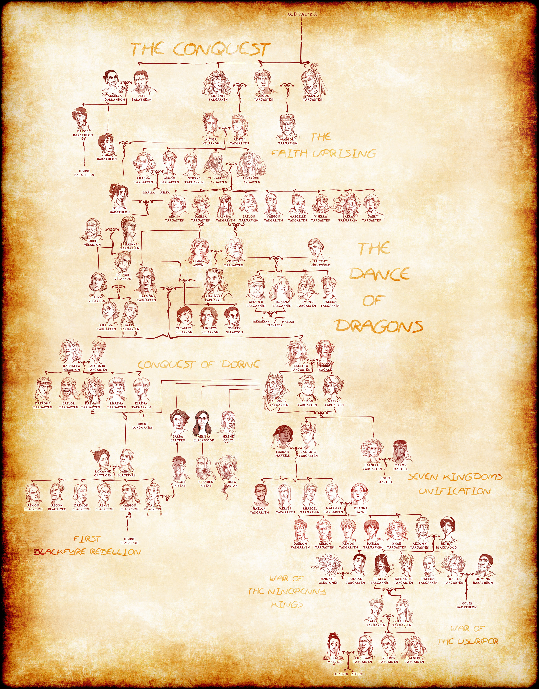

## Why is the King of the seven kingdoms referred to as King of the Andals, the Rhoynar, and the First Men.?

The king of the seven kingdoms is referred as:

- **XYZ of house ABC, pth of his name, King of the Andals, the Rhoynar, and the First Men.**
- pth of his name => he is the pth person in the ABC house to hold the name **XYZ**.
- For e.g John Snow will be called **Aegon** of the house Targaryen, 6th of his name. Because there have been 5 **Aegon** before him.

Because all the humans in **Westeros** are descendants of either the First Men, The Andals or The Rhoynar. Why?

[ASOIAF Detailed Timeine](https://awoiaf.westeros.org/index.php/Timeline_of_major_events)

**Past a certain point, all the dates grow hazy and confused, and the clarity of history becomes the fog of legend.**  
—Hoster Blackwood, to Jaime Lannister

## Dawn Age

### The Children of the Forest: Prehistory
- Non Human Race.
- Original Inhabitant of **Westeros**, Lived Alongside Giants.
- Obsidian Weapons and weir-wood bows, Powerful Magic.
- They Lived everywhere (almost except **Dorne** or iron islands?).
- Believed Weir-wood trees were gods.

### First Men (Bronze weapons): -12000 AC

- They came to **Westeros** probably from somewhere in **Essos** (grasslands of essos?).
- Started settling down. Chopped and burned Weirwoods (Children's Gods).
- War between First Men and Children for thousand of years.
- Ended with a pact: **-10000 AC**
    + The two races agreed to peaceful coexistence.
    + Granted Open lands to humanity and the forests to the children, who had been greatly diminished. 
    + 4000 years of friendship b/w men and the children.
- The First Men eventually set aside their religion to worship the children's secret gods of the wood (Old Gods), and like the children they carved faces into the weirwoods, creating heart trees. 
    + Except: Drowned Gods of Iron Islands.
- The children of the forest taught them to use ravens to communicate over long distances, but in those days the birds would speak the words.

## Age of Heroes

### The Others (The white Walkers)

- Capable of resurrecting dead as wights.
- Children of Evil God of Darkness.
- Their coming brings the night and winter.
    + Weakness
        * Obsidian or Dragon Glass or Frozen Fire
- Came from Lands of Always Winter (northernmost part of **Westeros**)
    + Perpetually Frozen.
    + Brought with them cold and darkness that lasted generations (The Long Night).

### The Long Night and Battle for the Dawn: -8000 AC or -6000 AC

- Others invaded from the north bringing death and destruction to children and First Men, during an extended period of winter known as the Long Night.
- The children joined with the First Men, led by the last hero, to fight against the Others.
- Others were driven back into the Lands of Always Winter. 
- Night's Watch was created to keep them at bay.
- Six thousand or eight thousand years ago the First Men built the Wall.
- **Bran the Builder, the legendary founder of House Stark**, is said to have enlisted the magical aid of the children during the construction of the Wall.
- Children of the forest gave the black brothers a hundred obsidian daggers every year during the Age of Heroes.

## Age of Valyria

- While **Westeros** was recovering from the Long Night, in Essos, the peaceful sheep-herding folk of the **Valyrian peninsula find dragons.**
- The **Valyrians** tame the dragons with magic. Basically conquer everything including slaver's bay (from Old Ghis) in Essos. **-8000 AC to  -4700 AC**

### Invasion of Westeros by Andals (Steel Weapons): -4700 AC

- The **Andals**, who had been living in Andalos (In Essos), traveled west to flee the upcoming Valyrians and prevent slavery. 
- They first landed in the Fingers in the Vale of Arryn. From there, they spread all across **Westeros**.
- Followed Faith of the Seven called New Gods.
- They fought both the First Men and the children of the forest
- One by one, the six southern kingdoms fall and the weirwoods are burned. 
- Only the north remains under the rule of the First Men, in large part due to the strategically-located fortress of Moat Cailin.
- Old Gods were largely replaced by The Faith in the south.
- Moat Cailin held back the Andals from the north, however, so some children fled north.

### Rhoynar Migration to **Westeros**: -950 to -700 AC

- The Valyrian Freehold's slow westward expansion brings it into conflict with the **Rhoynish cities along the great River Rhoyne** (In Essos), a vast waterway.
- War lasted for about 250 years. Rhoynar lost.
- **Nymeria a Rhoynish warrior queen** along with women and children on 10000 ships fleed across the narrow see, seeking refuge in Dorne in souther **Westeros**. 
- **Nymeria married the martell lord and estabished the House Martell of Dorne**

### Migration of the Targaryens: -126 AC

- Following a prophetic dream of his daughter Daenys, Lord Aenar Targaryen (a nobleman) decides to leave Valyria with his family and all their belongings. They settle on Dragonstone in **Westeros**.

### The Doom of Valyria: -114 AC

- The nature of the Doom is unclear, save that heavy volcanic and seismic activity are involved, likely due to the Fourteen Flames, the mountains where the dragons were first discovered. 
- The Valyrian peninsula is shattered and the city of Valyria is laid waste, although not completely destroyed. 
- The dragons of Valyria are virtually wiped out and the Valyrian Freehold crumbles apart in the Century of Blood. 
- Its various city-states break apart, asserting their independence and surviving to this day as the Free Cities and the cities of Slaver's Bay.

# The Seven Kingdoms

- Over the centuries following the **Andal** invasion, the southern kingdoms of the First Men fall, and eventually the Andals raise up six powerful kingdoms of their own.
- **House Stark** finally subdues **House Bolton**, their primary antagonists for dominance in the North. 

- Later **Karlon Stark** would defeat sea raiders from the east and found the cadet branch **House Karstark**. In the west, the ironborn of the Iron Islands rise to power. This was alongside the Rohynar Migration.

## Targaryen Dynasty: 0-283 AC

-  **Aegon** the Conqueror invades **Westeros** and in two years' time subdues and unites six of the seven kingdoms of **Westeros** under his banner and constructs a new capital city at King's Landing. Dorne remains independent, however. 

- [Image Credit](https://www.deviantart.com/poly-m/art/House-Targaryen-complete-Family-Tree-614284707)

