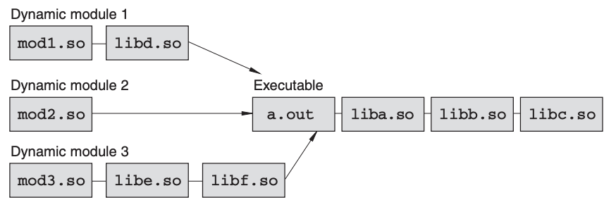

## SHARED LIBRARIES AND DYNAMIC LOADING

[Source](https://cseweb.ucsd.edu/~gbournou/CSE131/the_inside_story_on_shared_libraries_and_dynamic_loading.pdf)

#### Compilers and object files

```c
#include <stdio.h>
int x = 42;
int main() 
{
    printf(“Hello World, x = %d\n”, x);
}
```

The object file genearted by above code is divided into sections

1. Text Section: Machine Code

2. Data Section: Global Varibale X

3. Read Only Section: String literal "Hello World, x = %d\n"

4. Symbol Table:  Can be viewed using Unix `nm` command
   
   ```
   $ nm hello.o
   00000000 T main
            U printf
   00000000 D x
   ```
   
   - `main` is at `00000000` offset away from beginning of **T**ext Section.
   
   - `x` is at `00000000` offset away from beginning of **D**ata Section.
   
   - `pirntf` is **U**ndefined in the source file.

#### Linkers and linking

To build an executable linker does the following:

1. Fist Pass: Scan all object files and concatenate their sections to create a single object file.

2. Second Pass: Bind symbol names to real memory address
   
   - Uses a relocation list present in each object file for this. `objdump -r hello.o`

#### Libraries

##### Static Libraries (Static Linking)

- Archive of multiple object files.

- A collection of raw object files strung together along with a table of contents for fast symbol access.

**When a static library is included during program linking, the linker makes a pass through the library and adds all the code and data corresponding to symbols used in the source program.** Some problems because of this are: 

- If patching the library is ever necessary due to a bug, everything linked against that library must be rebuilt for the changes to take effect.

- Also, copying library contents into the target program wastes disk space and memory—especially for commonly used libraries such as the C library.

```c
#pragma weak foo
/* Only included by linker if not already defined in the library*/
void foo() {
...
}
```


##### Shared Libraries (so) or Dynamic link Libraries (dll) (Runtime Linking)

- Using shared libraries delays the actual task of linking to runtime. Performed by Dynamic Linker Loader.

- Allows OS to do several memory optimizations
  
  - The operating system can arrange to place library code in read-only
    memory regions shared among processes (using page-sharing and other virtual memory techniques).
  
  - So, if hundreds of programs are running and each program includes the same library, the operating system can load a single shared copy of the library’s instructions into physical memory.


**Consider the following Example**

```bash
gcc hello.c -lpthread -lm
```

If the libraries `-lpthread` and `-lm` have been compiled as shared libraries (.so files), the static linker instead of copying the contents of libraries into an executable, it will record the name of the libraries in a list (Library Dependency List) in the executable. This list can be seen using `ldd` command. 

```
$ ldd a.out

libpthread.so.0 => /lib/libpthread.so.0 (0x40017000)
libm.so.6 => /lib/libm.so.6 (0x40028000)
libc.so.6 => /lib/libc.so.6 (0x40044000)
/lib/ld-linux.so.2 => /lib/ld-linux.so.2 (0x40000000)
```


During runtime, the dynamic linker loader will bind unresolved symbols by searching in the libararies in the order in which they appear in the list and use the first definition of the symbol encountered in case more then one libraries define the same symbol.


Some problems:

- The linking process happens at each program invocation.

- Solution: **indirection tables and lazy symbol binding.**
  
  - The static linker creates a jump table known as a **procedure-linking table (PLT)** in the final executable.
  
  - Linker resolves all Unresolved symbols by pointing them to corresponding entries on the PLT.
  
  - The dynamic linker simply clears all the PLT entries and sets them to point to a **special symbol-binding function** inside the dynamic library loader.
  
  - As each library function is used for the first time, the dynamic linker regains control of the process and performs all the necessary symbol bindings. 
  
  - After it locates a symbol, the linker simply overwrites the corresponding PLT entry so that subsequent calls to the same function transfer control directly to
    the function instead of calling the dynamic linker again.
  
  - To see symbol bindings beinf performed set `LD_DEBUG=binding`

#### Library Loading

Dynamic Linker --> `ld.so` , maps library names in the in the executable to absolute path in library search path set in `/etc/ld.so.conf` Other libaries can be specified using `LD_LIBRARY_PATH` variable or using linker parameters such as `-R or -Wl, -rpath`. The paths are also cached in `/etc/ld.so.cache`


The library loading order is determined by a breadth-first traversal of library dependencies starting with the libraries directly linked to the executable.


You can obtain detailed information about how the dynamic linker loads libraries by setting `LD_DEBUG=libs`


#### Library initialization and finalization

Preliminary steps before code execution, creating static objects etc.

- DL uses `_init()` function or `init` section in each loaded
  library.

- The invocation of `_init()` functions follows in the reverse order of library
  loading

- Similarly, `_fini()` functions for program termination. Opposite order on `_init()`

#### Dynamic loading

The dynamic linker has an API for accessing symbols and loading new libraries at runtime (dynamic loading).

- `dlopen()`: Loads a new shared library.

- `dlsym()`: Looks up a specific symbol in the library. We used this 😁.

- `dlclose()`: Unloads the library


Unlike standard linking, dynamically loaded modules are completely decoupled from the underlying application. 

The dynamic loader does not use them to resolve any unbound symbols or any other part of the normal application-linking process.


Following image contain Linkchains created by dynamic loading. Each dynamically loadable module goes on a new linkchain but can still bind to symbols defined in the primary executable.





One consequence of the tree structure is that each dynamically loaded module gets its own private symbol namespace. So, if a symbol name is defined in more than one loadable module, those symbols remain distinct and do not clash with each other during execution.


Use `LD_PRELOAD` to dynamically load a library.


