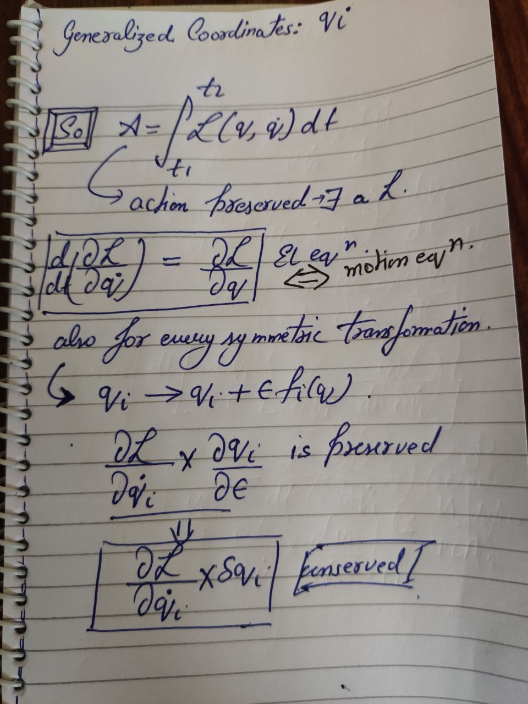
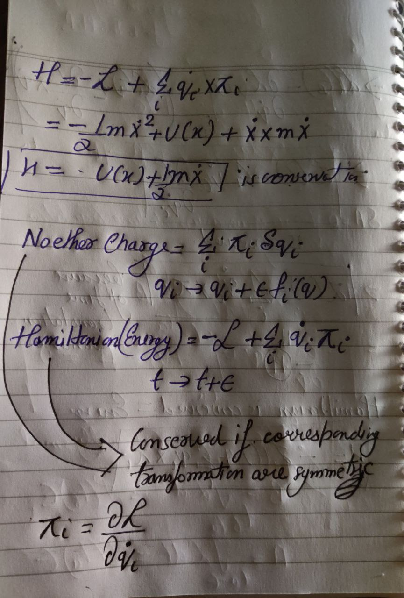

## [Link to Course](https://www.youtube.com/view_play_list?p=189C0DCE90CB6D81)

### Classical Mechanics

- **Phase Space**: Space of possible states of the system.
	- **State**: Everything you need to know to predict the next state.

- **What Laws are allowed?**: Laws should be deterministic both into the future and the past. Knowing the current state we can determine the previous or future state by applying the laws. There should be no ambiguity.

- If phase space breaks into components which are not connected. Then something (information) is conserved within those components.

- At the moment all laws including quantum mechanics preserve information.

- To predict the next state of a particle in real world we need to know its position and its velocity. So the phase space is 2D (position, velocity).

- In newtonian physics, speed of light is infinite or forces act instantaneously. 

#### Principle of Least Action

For every mechanical system there exixsts a quantity called a lagrangian (`L`) which is a function of the trajectory `q(t)` and its time derivative `q'(t)` such that minimizing the action `A` expressed as `Integral of L over dt from t1 to t2` (given the `q(t)` passes through `q(t1)` and `q(t2)`) yields the true trajectory `q*(t)` actually folloed by the mechainical system.

**In case of newtonian systems**

`L = K.E -  P.E`

### Symmetry

A symmetry is an active operation that you can do on the system that does not change the value of Action (Lagrangian).

#### EVERY SYMMETRY IS ASSOCIATED WITH A CONSERVATION LAW

- Conservation of Linear Momentum is a direct result of translation symmetry (invariance).
- Conservation of Angular Momentum is a direct result of rotational symmetry (invariance).

- Energy conservation is a direct result of time translational symmetry (invariance).

- As long as your system is time translational invariant corresponding to PLA there exist a quantity called Hamiltonian (Energy) that is conserved.

- Or Energy is defined as the quantity that is conserved when the system exhibits a time translational symmetry corresponding to PLA.

