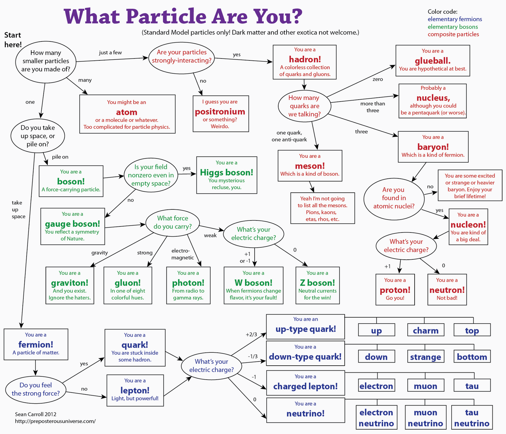

## A picture that speaks a thousand words (literally)!!

---

## Based on Mass (OLD)

- **Leptons** 
    + Mass <0.05% of proton
    + Greek word *leptos* meaning light, thin, small
    + electrons and neutrinos
- **Mesons** 
    + Mass 10-50% of proton
    + Greek word **meso** meaning Intermediate
    + muons etc.
- **Baryons**
    + Mass 100-200% of proton
    + Greek word *barys* meaning heavy
    + protons, neurtons

---

**Hadrons**: Greek word **adros** meaning heavy

- Particles that feel strong force   
- All Baryons do   
- Leptons don't   
- Most Mesons do except some (e.g muon)   

---

## Based on Spin

- **Boson**
    + Integer Spin
    + Named after Satyendra Nath Bose
    + All mesons (except muon)

- **Fermions**
    + Half Integer Spin
    + Name after Enrico Fermion
    + All leptons, baryons

---

Discovery of **Quarks**

- Fermions
- With +1/2 or -1/2 spin

----

### Final Classification Explanations

- Spin Half **Fermions**
    + Quark: +1/2 or -1/2 spins: Feel Strong Force    
    + Carry Quarks:**Baryons** 
        * Have three Quarks: 
        * Therefore can feel strong Force (Hadrons)
        * Therefore can have only -1/2, +1/2, -3/2, +3/2 spins 
        * proton, neutron, delta particle  
    + Don't Carry Quarks: **Leptons**
        + They don't feel Strong Force (Not Hadrons)
        + Like Quarks but without feeling the Strong Force
        + e.g Electron, muon, neutrino        

- Integer Spin **Bosons**   
    + Carry Quarks: **Mesons**
        + Have two Quarks Inside (Quark and Antimatter Quark)
        + Therefore can feel strong Force (Hadrons)
        + Therefore can have only Integer Spins
            * +1/2 + 1/2 = +1
            * +1/2 - 1/2 = 0
            * -1/2 - 1/2 = -1
        + e.g pions, kons
    + Don't Carry Quarks: **Bosons that aren't Hadrons**
        + Therefore don't feel strong Force 
        + Particles that carry forces/cause forces to happen
            + Photon:  ElectroMagnetism
            + W & Z Boson: Weak Nuclear Force
            + Gluons: Strong Nuclear Force
            + Higgs Boson: Particle corresponding to Higgs Field (Mass Force?)
            + Graviton (Haven't been disovered Yet): Gravity